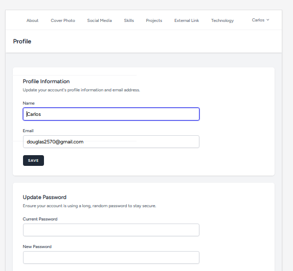

# Projeto Portfólio

Esse projeto foi desenvolvido com o intuito de criar um espaço onde eu possa mostrar os meus projetos. Ele consiste em duas aplicações uma responsável por mostrar o porfolio e outra por fazer seu gerenciamento (dashboard)

### Tecnologias utilizadas
* Front-end
    * Angular 14
    * Tailwindcss
    * Flowbite
    
* Back-end    
    * Laravel (Dashboard e API REST)
    * Breeze
    * Sqlite       

### Showcase
#### 1° Aplicação

#### 2° Aplicação

